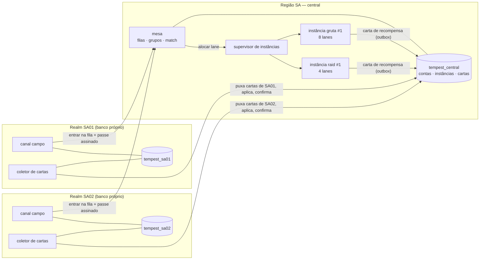
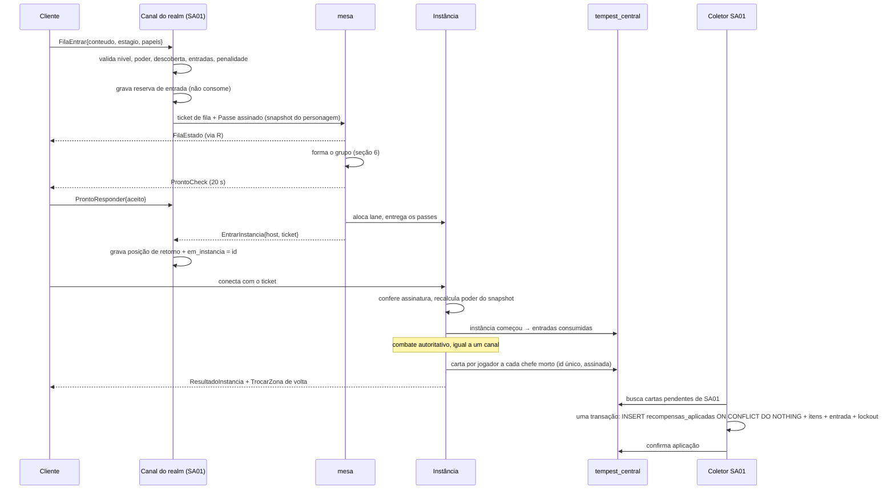

# Dungeons, raids e chefes: conteúdo de grupo entre servidores

> Documento de **desenho**, não de estado. Nada daqui está implementado além do
> que a seção "O que já existe" lista. Pesquisa do MIR4 no começo, desenho do
> Tempest no meio, plano de fases no fim. Números marcados com ⚠️ são pontos de
> partida, não medições: afinam no playtest.

## Decisões (atualizado 2026-09-16)

Decididas pelo usuário. Valem sobre qualquer trecho abaixo que diga outra coisa.

| # | tema | decisão |
|---|---|---|
| 1 | **Tipo** | Por agora, só **dungeon com fim**: instância solo ou de grupo com andares, semi-chefe, chefe final e baú (Porão, Gruta, Caçada). O modelo **por tempo** (Praça Mágica / Pico Secreto) fica fora do escopo — ver "Ideia futura" no fim |
| 2 | **Dificuldade** | **Estágios numerados** por conteúdo (1, 2, 3…), cada um com mobs e chefe de nível maior, liberado pela vitória no anterior + nível + poder. Substitui Normal/Difícil/Pesadelo (seção 4). O topo (estágio 5 de conteúdo 60+) exige **Selo da Tempestade feito por craft**, no lugar do Pesadelo |
| 3 | **Grupo** | **Lista de salas** (Procurar/Criar, entre servidores da mesma região, `Nome@REALM`) **e fila automática**, convivendo (seção 6) |
| 4 | **Morte** | **Sem perda de XP e sem reparo.** Ressurreição dentro da instância com espera crescente: 10 s na 1ª morte, +10 s a cada morte seguinte. Wipe volta ao início do andar atual; tempo esgotado = estágio falho (seção 7) |
| 5 | **Chave de craft** | Chefe de dungeon **e** de raid: 15% cinza (< 20) · 10% verde (20–39) · 6% azul (40–59) · 3% épica (60–79) · 1% lendária (80+). Chefe do mundo: 5/3/2/1/0,3%. **Raid não dobra.** A cor segue o nível do estágio (`shared::chaves`, implementado) |
| 6 | **Craft** | Nível mínimo: verde 20, azul 40, épico 60 (implementado) |
| 7 | **Interface** | Nada abre por tecla: tudo pelo HUD e pelo Menu |
| 8 | **Auto combate** | **Nunca desvia** de golpe telegrafado. É intencional: o desvio é do jogador, e nada neste doc propõe desvio automático |
| 9 | **Estágios** | **5 por conteúdo**, +2 níveis de mínimo por estágio (seção 4) |
| 10 | **Selo da Tempestade** | Receita de craft (Marcas + darksteel + Pó Cintilante) e teto de **2 por semana por conta**, como na seção 8 |
| 11 | **Correio** | **Junto com as Entregas do Mercado**: uma caixa só (Menu → Comércio → Mercado → Entregas) para recompensa de dungeon, 1ª vitória, bolsa cheia e mercado |
| 12 | **Wipe** | **Sem limite de wipes.** Só o relógio encerra o estágio |
| 13 | **Entrada** | **Sem entrada física no mundo.** Nada de arco para tocar no mapa, marcador ou marca de "descoberto": a **janela de Aventuras** é o único caminho. A descoberta por missão é a quest **510** da cadeia do Mestre, que já existe e fecha ao vencer uma dungeon. Isto NÃO cancela a arena voxel da F4 (onde a luta acontece) — são coisas separadas, e a versão anterior deste doc as descrevia juntas |

Pesquisa detalhada do MIR4: [PESQUISA_DUNGEONS_MIR4.md](PESQUISA_DUNGEONS_MIR4.md).

## Implementado (F1 + F2, set/2026)

**Onde a instancia roda.** Numa FASE do proprio canal, e nao num processo
proprio: tudo o que esta' na instancia (jogadores, mobs, chefe, bau, saque)
leva o componente `Instancia(id)`, e o canal filtra por ele no AOI, na IA dos
mobs, nos golpes, nos telegrafados, no alvo e na coleta do saque. A arena sao
4 sitios planos da propria ilha, longe da cidade, do porto e dos chefes de
campo (um por andar); duas instancias usam a mesma arena sem se ver. Nada novo
trafega (o terreno continua da semente). Codigo: `server/src/world/dungeon.rs`.
Consequencia: a fila e as salas juntam quem esta' no **mesmo canal**. A `mesa`
(`server/src/mesa.rs`) ja' e' so' regra, com chaves e eventos — a F5 troca a
implementacao por um servico entre canais/realms sem mexer na instancia.

| decisao | como ficou |
|---|---|
| Porão e Gruta | 3 Porões (6, 14, 22) e 5 Grutas (10–50), catálogo em `shared::dungeon::CONTEUDOS`. Cemitério de Navios (60) e a Caçada aparecem com cadeado |
| Andares | Porão: 2 andares + chefe. Gruta: 3 andares (o 2º com semi-chefe, ×4 vida) + chefe do catálogo de chefes no nível do estágio (golpes telegrafados). Andar limpo → todo mundo vai pro próximo sítio |
| Estágios | 5, +2 níveis cada, poder 80/85/95/105/115% de `poder_referencia` ⚠️ (calibrado: sem ponto nenhum, com a arma inicial, passa no estágio 1). Vencer libera o próximo; o 5 de conteúdo 60+ gasta um Selo |
| Grupo | Fila automática (fecha com 5, ou com o mínimo 3/4 depois de 5 min) + salas (Criar/Procurar/Entrar, líder começa, sala cheia começa sozinha, "completar pela fila" depois de 1 min, sala parada 10 min fecha). Pronto-check de 20 s; recusa devolve quem aceitou ao topo. Nomes `Nome@REALM` |
| Morte | Sem perda de XP. Espera 10 s, +10 s por morte (`Reviver`; "Levantar"/"Reviver na cidade" viram o Reviver dela). Revive com vida cheia no andar atual. Wipe: o andar recomeça inteiro, sem limite; o relógio não para |
| Tempo | Esgotou: estágio falho, sem baú, entrada gasta; todos voltam em 8 s |
| Baú | Físico no chão onde o chefe caiu (NPC com papel `PAPEL_BAU`, o cliente desenha uma caixa); toque abre só pra quem estava lá; abre sozinho em 60 s; instância fecha em 75 s. Rolagem: cobre, darksteel, pó, material na cor da faixa, peça (tabela da seção 8, teto duro de grau, **vinculada** na instância) e chave (`Fonte::Dungeon`); Ajudante sem peça nem chave. Bônus de tempo (≤ 60% do limite): +50% Marcas e 1 material extra |
| Idempotência | O id do baú vai em `characters.dungeon_json` no MESMO save da bolsa: reiniciar não reabre |
| 1ª vitória | Semanal por CONTA (`dungeon_contas`): peça garantida uma linha acima, no correio. De todas (por personagem): peça + 1 chave da cor, no correio |
| Correio | Local do realm (`dungeon_json.correio`), mostrado na aba **Entregas** do Mercado, com "Receber" por carta. Não depende do banco central |
| Entradas | Gruta 2/dia (acumula 4), compra 2/dia com ouro (×1, ×3); Porão com recompensa 3/dia. Reset 04:00 de Brasília, semana na quarta. Nunca TP |
| Selo | Receita 1900 (120 Marcas + 5.000 darksteel + 3 pó, nível 60) com teto de 2 por semana por conta no servidor |
| Diárias | "Porão do dia" (6x6) conta a vitória em qualquer dungeon |
| Telas | Menu → Aventura → Dungeons (lista, estágios com cadeado e motivo, entradas, fila, salas), faixa "PROCURANDO GRUPO", pronto-check, HUD da instância (relógio, andar, inimigos, porta Sair), "VOCÊ CAIU / Reviver em N s", resultado com o baú. Onde obter das chaves abre a janela |

**Ficou para depois:** mesa entre canais/realms (F5), papéis e composição
T/S/D, voto de expulsão, backfill e penalidade de abandono, Mestre das Marés
(loja de Marcas), baú de andar, ajuste de nível para baixo, enrage, raid (F3),
tabelas de loot editáveis no banco (hoje o baú é código, com o teto duro).

**Descartado — decisão do dono (16/09/2026): não haverá entrada física.** Nada
de arco no mapa para tocar, marcador de entrada nem marca de "descoberto". A
entrada é pela janela de Aventuras, como já é hoje, e a descoberta por missão
é a quest **510** da cadeia do Mestre, que existe e funciona. Isto não cancela
a arena voxel da F4 (onde a luta acontece): são coisas separadas.

**Teste com bots:** `server/src/bin/dungeonbot.rs` (ver o cabeçalho). Variáveis
SÓ de teste no servidor: `MMO_DUNGEON_TESTE_VIDA`, `MMO_DUNGEON_TESTE_DANO`,
`MMO_DUNGEON_TESTE_LIMITE_S`.

## 1. O que o MIR4 faz (pesquisado)

Fontes no fim do documento. Onde as fontes divergem ou não dizem, está marcado
**(incerto)**.

| conteúdo | formato | grupo | entrada | requisito | o que dá |
|---|---|---|---|---|---|
| **Raid** | instância com vários inimigos, em **estágios numerados** (até o 14º, mobs 165) | solo possível; até **5** (incerto) | **2 grátis/dia**, +2 recargas com gold; mais entradas pelo prédio *Torre da Vitória* | poder de entrada por raid; nível 20 (incerto) | 1ª vitória **por correio** (estátua de dragão, pedra Épica/Lendária); drop por chance, bolsa cheia → correio |
| **Boss Raid** | um chefe forte, em estágios (até o 10º, nível 160) | até **15** (incerto) | **1 grátis/dia**, +2 recargas com gold | poder por chefe; nível 30 (incerto) | idem, e "mais membros, mais recompensa especial" |
| **Hell Raid** | topo: chefe de nível **100/120/140** | até **15** | **sem entrada grátis**: ticket do baú de tarefa diária + 1 de NPC; **15 min** | nível 90 + poder | 1ª vitória Épica/Lendária; **bônus por matar o de 140 dentro dos 15 min**; ressurreição 10 s, +10 s por morte |
| **Competitive Raid** | PvE com dois times sorteados; vence quem dá o último golpe no chefe | 10v10 a 15v15 | 1 grátis/dia; 10 min | (não encontrado) | vencedor ganha mais; **baú no chão por 5 min**; sair antes queima a entrada |
| **Path of Fiery Battle** | desafio de 6 atos × 10 cenas | solo ou até 5 | ticket consumível | nível 120 | wipe **guarda o estágio**; moeda trocada no NPC |
| **Praça Mágica / Pico Secreto** | mapa aberto com PvP, **30 min/dia** extensíveis por ticket | solo, disputado | 2 entradas grátis/dia, recarga com gold | andar por **poder** (Pico 1F: 7.900 de poder, mobs 25–40; 6F: 67.000, mobs 105–115; Praça 10F: 208.000, mobs 160–175) | darksteel em nós especiais, baús de chefe (materiais de livro de skill), pedras de melhoria; chefe renasce por **horário fixo** (a cada 3h) ou 30–60 min |
| **Versão "Fissurada" (11F)** | andar de topo | solo | **só por ticket** (craft, loja do clã 3×/semana, drop raro) | 270–275 mil de poder | materiais Épicos diários |
| **Chefe de Mundo** | arena por portal, **450 por arena**, excedente em fila | aberto | horário semanal fixo, servidor sorteado | — | (incerto: a regra de contribuição não é pública) |
| **Ataque dos Espectros** | evento semanal de 1h no 4º andar dos vales | aberto | horário | — | nomeado → chance de semi-chefe → chance de chefe; baús com **material de dragão Épico** |
| **Expedição** | **entre servidores**: invadir outro servidor e atacar os chefes de campo e o cofre de darksteel | 300 por servidor | janela de até 4h, 21:00 | clã **top 20** | darksteel em massa; o invasor tem **5 vidas** |
| **Captura do Vale / Cerco de Bicheon / Sabuk** | guerra de clãs; Sabuk junta os reis de cada servidor num **servidor de dominação** | clãs | semanal / a cada 4 semanas | pesquisa de clã | 15% de imposto do darksteel minerado no vale, título |
| **Vale da Vida e da Morte** | campo de batalha entre servidores | 10 times de 5 | 2/dia | nível 100, **todos normalizados** no nível 100 | pontuação, **MVP** leva caixa extra |

O que importa tirar disso:

- **Grupo entre servidores já é da região.** O MIR4 forma o grupo de raid com
  jogadores "da sua região", e o chat de grupo mostra o servidor de origem ao
  lado do nome. É uma **lista de recrutamento** (Buscar / Criar raid); auto-match
  cego **não foi encontrado** em nenhuma fonte. A **fila automática do Tempest é
  decisão nossa** (liquidez de realm novo), não cópia do MIR4.
- **Dificuldade por estágios numerados**, cada um com mobs de nível maior, e não
  Normal/Difícil/Pesadelo.
- **Morte em raid não custa EXP**: só a espera de ressurreição cresce (Hell Raid:
  10 s, +10 s por morte). Sair é pela porta abaixo do relógio.
- **Recompensa que não cabe vai por correio**, e a 1ª vitória chega por correio.
- **O portão é o poder, não só o nível.** Cada andar e cada chefe mostra o
  "Entry Power Score".
- **Entrada diária pequena, recarga com gold.** O gold da recarga é um ralo.
- **A primeira vitória paga muito mais.** É o que puxa para o conteúdo novo sem
  obrigar a repeti-lo pra sempre.
- **Material Épico vem de conteúdo de topo**, com saída diária fixa
  (Fissurada, Hell Raid, Expedição), e não de mob comum.
- **MVP**: o maior pontuador leva uma recompensa extra, calculada
  individualmente.
- **Normalização de nível** existe onde a competição precisa ser justa.

## 2. O que copiamos, adaptamos e descartamos

| do MIR4 | decisão | por quê |
|---|---|---|
| Raid de 5 e Boss Raid de 15 | **adaptar: 5 e 10** | Com 15, o AOI de 60 entidades enche só de jogador, pet e efeito, e sobra pouco para os adds. 10 mantém o chefe legível e cabe em muitas raids por processo |
| Portão por poder | **copiar** | O `poder` já existe no cliente (`client/bolsa.rs`). Vai para o `shared` (seção 12) |
| Entradas diárias + recarga com gold | **copiar**, com teto | É o ralo de gold mais limpo que existe: o jogador escolhe pagar |
| Primeira vitória vale mais | **copiar** | Premia descobrir o conteúdo, não repetir |
| MVP | **adaptar** | Contribuição **por papel**, e não só dano, senão tanque e suporte nunca são MVP |
| Grupo da região entre servidores (lista Buscar/Criar) | **copiar e ampliar** com fila automática (**nossa**: o MIR4 não tem) | Um realm começando não tem gente para lotar uma raid de 10 às 3h da manhã. A lista serve quem já tem grupo ou quer escolher; a fila, quem só quer jogar. O pool entre realms dá liquidez às duas |
| Normalização de nível | **adaptar: só para baixo** | Quem está acima da faixa desce até o teto dela. Mata o "carregar" e mantém o chefe difícil |
| Praça Mágica / Pico Secreto (por tempo) | **fora do escopo atual** (ver "Ideia futura") | Decisão 1: por agora só dungeon com fim. O papel "farm de darksteel por tempo" já é da coleta e da colônia offline |
| Chefe de mundo com 450 | **adaptar: fragmentos de ≤ 150** | Um processo não fecha o tick com 500 (SERVIDORES_E_CANAIS, "Evento em mapa único"). Vira várias instâncias paralelas |
| Espectros (nomeado → semi-chefe → chefe) | **copiar** no chefe de campo | Transforma o respawn fixo em evento, e custa só dado |
| Expedição / Cerco / Sabuk (PvP de clã) | **descartar por ora** | Não existe clã. PvP entre realms é outro documento |
| Hell Raid só por ticket | **adaptar** como **estágio de topo com Selo da Tempestade craftado** | O topo não tem entrada grátis ilimitada. O ticket sai do craft (como o Fissurado): ralo de material, nunca de dinheiro |
| Estágios numerados | **copiar** | Substitui Normal/Difícil/Pesadelo; escala por anos adicionando estágio no topo |
| Morte sem perda, ressurreição crescente | **copiar** | Tira o "reparo por morte"; a espera crescente pune o erro repetido sem punir o aprendizado |
| 1ª vitória e bolsa cheia por correio | **copiar** | Casa com a carta de recompensa (seção 5) |
| Baú no chão para abrir | **adaptar** | Boa cena de recompensa no celular; aqui abre sozinho ao sair, nada se perde |
| Bônus por tempo no chefe | **copiar** | Premia execução, não repetição |
| Ticket vendido por dinheiro | **descartar** | TP **nunca** compra entrada nem recompensa. É pay-to-win, e a ECONOMIA decide que TP só vai à loja cosmética e às pedras de refino |
| Peça de equipamento no baú | **adaptar** (ver seção 8) | Hoje "mob e chefe não dão equipamento" (LOOT_DOS_MOBS). A regra continua para **mob**. O **baú de conclusão** vira a única fonte de peça fora do craft |

## 3. Catálogo de conteúdos do Tempest

Cinco tipos. Nome temático primeiro, o genérico entre parênteses.

| tipo | nome no jogo | grupo | duração alvo | limite | entradas | abre em |
|---|---|---|---|---|---|---|
| **Porão** (dungeon solo) | *Porão do Naufrágio* | 1 | 6–8 min | 10 min | ilimitado, recompensa 3/dia | nível 6 |
| **Gruta** (dungeon de grupo por andares) | *Grutas da Maré* (uma por ilha) | 3–5 | 12–18 min | 25 min | **2/dia** (acumula até 4) + 2 compráveis | nível 10 |
| **Raid** (chefe) | *Caçada* | 6–10 | luta de 8–12 min | 30 min (enrage aos 10–12) | **1/dia** (acumula até 3) + 1 comprável | nível 25 |
| **Chefe de campo** | *Maré Sangrenta* | aberto, no canal | 5–10 min | — | sem entrada; baú 1×/dia por chefe | nível da ilha |
| **Chefe de mundo** | *Chamado do Leviatã* | aberto, fragmentos ≤ 150 | 20 min | horário | 1 baú por evento | nível 30 |

Regras que valem para todos:

- **Reset diário às 04:00** do fuso do realm; **reset semanal na quarta às
  04:00**. Mesmo horário para todos os realms da mesma região, senão o pool
  entre realms fica com gente de "dias" diferentes.
- **Entrada é consumida quando a instância começa** (todos entraram e o
  primeiro inimigo foi puxado), não na fila. Cai da fila ou o pronto-check
  falha: nada foi gasto.
- **Quem entra com a entrada zerada vai como Ajudante.** Ganha cobre, XP e
  Marcas da Tempestade (seção 8), mas nem peça nem chave. É o que mantém a fila
  cheia de gente que já fez o dia. Sem ajudante, a fila morre às 23h.
- **Entrada comprável**, com gold e preço crescente no dia: 1ª a 1×, 2ª a 3×
  ⚠️. É ralo, e o teto impede de virar torneira de quem tem gold.
- **Entrada extra só por progressão** (colônia offline, nível de conta ⚠️), como
  os prédios do MIR4. **Nunca por TP.**
- **Sair** é pela porta embaixo do relógio, com toque. Sair antes do fim queima
  a entrada e conta como abandono (seção 6).

### Porão (solo)

É o `DUNGEON_MODE` que já existe (8 lanes, 4 salas, 10 min), com recompensa e
entrada. Serve de tutorial de "instância": entrar, sala, portão, chefe, baú,
voltar. **Não entra no matchmaking.** Tem uma por faixa até o nível 30; depois
disso o solo diário é a Gruta no estágio 1 pela fila automática. O Porão não
tem estágios.

### Gruta (grupo por andares)

- **3 andares + chefe.** Cada andar é uma ilhota ligada por ponte com portão,
  igual às salas da lane atual.
- Andar 1 é de mobs da faixa. Andar 2 tem um **semi-chefe**. Andar 3 tem uma
  mecânica de grupo simples (seção 7). Chefe no fim.
- **Recompensa por andar** (baú pequeno) **e na conclusão** (baú grande). Cair
  no andar 3 não zera o dia inteiro.
- Grupo de 5: **1 tanque, 1 suporte, 3 dano**. Aceita 3–4 nos estágios 1–2,
  com vida dos inimigos escalada (seção 4).
- **Estágios 1–5** (seção 4): a mesma arena, com mobs e chefe de nível maior.

### Raid (Caçada)

- **Um chefe**, com fases. Adds entre as fases.
- 10 jogadores: **2 tanques, 2–3 suportes, 5–6 dano**. Mínimo 6 nos estágios 1–2.
- **Estágios 1–5**, como a Gruta.
- **Baú por contribuição** a cada vitória, mais o **baú de primeira vitória
  semanal** por chefe e estágio, **por conta**. Esse segundo é o grande: é nele que moram
  as chances de Épico.

### Chefe de campo (Maré Sangrenta)

- Usa `boss_areas`, que já existe: um chefe por área, com respawn.
- Evento: durante a Maré (2×/dia por ilha ⚠️), os mobs **nomeados** da ilha
  têm chance de chamar um **semi-chefe**, e o semi-chefe chance de chamar o
  **chefe**. É a mecânica dos Espectros do MIR4.
- Fica no **canal**, sem trocar de processo. Contribuição por dano/cura/tanque,
  baú para quem passou do limiar. **Não é entre realms.**

### Chefe de mundo (Leviatã)

- Semanal. Instâncias de até 150, preenchidas pelo matchmaker **misturando
  realms** da região.
- A vida do chefe escala com quem está no fragmento. A contribuição é ranqueada
  **dentro do fragmento**.
- É a primeira coisa entre realms que o jogador vê em massa. Fica para depois
  da raid funcionar entre realms (fase 6).

## 4. Progressão e desbloqueio

### O que abre em cada faixa

O nível máximo é 100 (`CHAR_LEVEL_CAP`). As ilhas existentes cobrem até o 60
(`shared::terreno::ARQUIPELAGO`). **De 60 para cima não há ilha:** os
conteúdos de 60+ ficam amarrados a ilhas que ainda serão feitas (nomes de
trabalho abaixo).

| faixa | ilha | Porão (solo) | Gruta (grupo) | Caçada (raid) | chefe de campo |
|---|---|---|---|---|---|
| 1–10 | Bosque | *Porão do Naufrágio* (6) | — | — | Lobo Grande (existe) |
| 10–20 | Bosque | *Adega do Contrabandista* (14) | **Toca dos Lobos-do-Mar** (10) | — | Urso-Rei (14) |
| 20–30 | Geleira | *Casco Congelado* (22) | **Grutas de Gelo Fundo** (20) | **Mãe-da-Nevasca** (25) | Yeti Ancião (24) |
| 30–40 | Ermo | — | **Tumba das Areias Salgadas** (30) | **Escorpião-Colosso** (35) | Serpente das Dunas (34) |
| 40–50 | Planalto | — | **Mosteiro dos Ventos** (40) | **Grifo Trovejante** (45) | Carneiro de Pedra (44) |
| 50–60 | Planalto | — | **Forja do Titã** (50) | **Colosso de Basalto** (55) | Águia-Relâmpago (54) |
| 60–70 | *Recife da Tempestade* (nova) | — | **Cemitério de Navios** (60) | **Capitão Afogado** (65) | a definir |
| 70–80 | *Recife da Tempestade* | — | **Vórtice Submerso** (70) | **Rainha Kraken** (75) | a definir |
| 80–100 | *Olho da Tempestade* (nova) | — | **Fenda do Trovão** (80) | **Leviatã Desperto** (85) | — |
| 30+ | (evento) | — | — | — | Chefe de mundo **Chamado do Leviatã**, escalado por faixa |

O número entre parênteses é o nível mínimo do **estágio 1**.

### Como um conteúdo novo abre

Três portas, **todas** necessárias. Nenhuma sozinha abre.

1. **Nível** mínimo da tabela.
2. **Descoberta por missão.** A quest **510 · "O que há sob o naufrágio"**, da
   cadeia do Mestre (nível 6, depois da 509), apresenta a dungeon — que
   nenhuma missão do início mencionava — e fecha ao concluir uma, pelo
   objetivo `DUNGEON`. A entrada é pela **janela de Aventuras**; a fila abre de
   qualquer lugar.

   **Não existe entrada física, e isso é decisão, não pendência** (dono,
   16/09/2026). A versão anterior deste documento descrevia um arco no mapa
   que, ao ser tocado, marcava o conteúdo como "descoberto" — isso foi
   descartado. Quem mexer aqui no futuro: não reintroduza o arco achando que
   está completando algo que ficou pela metade.

   O objetivo `DUNGEON` **funciona**, e agora está verificado em execução, não
   só por leitura: `dg_terminar` chama `quest_on_evento` com ele, por membro
   presente e só na vitória. Medido com o `dungeonbot` num Porão vencido em
   83 s — a 510 e a diária 606 passaram de aceitas a prontas sozinhas. Há teste
   cobrindo a camada de quest (`vitoria_de_dungeon_fecha_as_missoes_de_dungeon`).
   O `RAID` é que de fato não existe: não há conteúdo de raid no catálogo, e
   nada avança o tipo.
3. **Vitória anterior** (só para a raid): vencer a Gruta da mesma ilha no
   estágio 1 pelo menos uma vez.

### Estágios (a dificuldade, decisão 2)

Cada Gruta e cada Caçada tem **estágios numerados**, como as raids do MIR4 (que
chegam ao 14º). Mesma arena e mesmo chefe; sobem o nível dos inimigos, o poder
exigido e a recompensa. Estágio novo entra **no topo**, sem mexer nos de baixo.

| estágio | abre com | nível dos inimigos e mínimo do jogador | poder mínimo |
|---|---|---|---|
| **1** | as três portas acima | mínimo da tabela | 80% do poder de referência |
| **2** | vitória no 1 | mínimo + 2 | 85% |
| **3** | vitória no 2 | mínimo + 4 | 95% |
| **4** | vitória no 3 | mínimo + 6 | 105% |
| **5 (topo)** | vitória no 4; em conteúdo **60+** também um **Selo da Tempestade** | mínimo + 8 | 115% |

Valores ⚠️. Cinco estágios cobrem a faixa de 10 níveis de cada conteúdo.

- **A vitória libera o próximo estágio para o personagem.** Não precisa repetir
  o 1 depois de liberar o 3.
- **Recompensa, cor da chave e teto de grau seguem o nível do estágio**
  (seção 8). A Forja do Titã (50) no estágio 5 é nível 58 e continua sem Épico;
  o Cemitério de Navios (60) já pode dar.
- **O Selo da Tempestade substitui o Pesadelo.** É consumido quando o estágio 5
  de conteúdo 60+ começa (entrada reservada e devolvida como as outras, seção
  3). Sai do **craft** no Mestre das Marés (Marcas + darksteel + Pó Cintilante
  ⚠️), com teto de **2 por semana por conta**, e 1 vem garantido no baú de
  primeira vitória semanal do estágio 4. Nunca por TP. É o ticket do Fissurado e
  do Hell Raid do MIR4, com o craft como ralo de material.
- **Fila e salas são por estágio**: o 2 não se mistura com o 4.

**Temporada** ⚠️: a cada ~8 semanas, um chefe do catálogo volta em
"Variante de Temporada" (mecânica extra, modelo recolorido) com um baú
cosmético. Sem poder novo, para não obrigar ninguém.

### Poder de referência

`poder_referencia(nivel)` é uma função do `shared`: o poder de um personagem
**daquele nível** vestindo os 7 slots **no grau esperado da faixa, tier II
+3**. O requisito é uma porcentagem disso, e não um número digitado por
conteúdo. Muda a curva do item, o requisito acompanha. É a regra de "uma
verdade por pergunta" do README: o mesmo `poder()` responde à ficha, à fila e
ao portão.

### Ajuste de nível (sincronia)

- **Para baixo, sempre.** Quem está acima de `nível_máx_da_faixa + 5` tem
  atributos e poder das peças **escalados até esse teto** dentro da instância.
  As skills não mudam (as 3 já abrem no 10).
- **Para cima, nunca.** Faltou nível ou poder, não entra.
- **Recompensa segue a faixa do conteúdo**, não do jogador. Nível 80 fazendo a
  Gruta do Bosque ganha material cinza, e em pouca quantidade (retorno
  decrescente, seção 8).
- **Vida dos inimigos escala com o grupo** abaixo do cheio: a Gruta com 4 tem
  85%, com 3 tem 70% ⚠️; a raid tem −6% por vaga vazia abaixo de 10.

## 5. Global entre servidores

### O problema

Realm é banco próprio e **não existe consulta que atravesse realms**
(SERVIDORES_E_CANAIS). Uma raid com gente de `SA01` e `SA02` não pode ler nem
gravar o banco de nenhum dos dois de dentro da instância. E o personagem
**não pode trocar de banco** para visitar: isso é merge, e merge é operação.

### A solução: o personagem vai de "passe", a recompensa volta por "carta"

Três peças novas, **fora** dos realms, na mesma camada da conta global e do
livro-caixa de TP que a ECONOMIA já exige:

| peça | o que é | onde mora |
|---|---|---|
| **`mesa`** (binário novo) | grupos, filas, matchmaking, pronto-check, alocação de instância, penalidades | processo único por região; estado quente em memória, frio no banco central |
| **processo de instância** | o **mesmo binário `server`** com `MMO_INSTANCIA=gruta\|raid\|leviata` e **sem `DATABASE_URL` de realm** | subido pelo `supervisor` de instâncias, como canal |
| **banco central** (`tempest_central`) | contas (já planejado para TP), instâncias, membros, **cartas de recompensa**, histórico de fila | fora de todos os realms |



### Fluxo de ponta a ponta



### O passe (snapshot somente-leitura)

O canal do realm monta e **assina** (ed25519, chave por realm, pública na
central):

```
Passe {
  passe_id, realm, conta_id, char_id, nome, nivel,
  conjunto_equipado, equipamento: [ItemInstance...],   // grau, tier, refino, encanto
  skills_liberadas, poder_calculado,
  consumiveis: [(item_id, qtd)],                        // poções que pode usar lá dentro
  reserva_entrada_id, estagios_liberados, selo_reservado,
  emitido_em, expira_em (30 min)
}
```

- A instância **recalcula** os atributos a partir do equipamento, com o mesmo
  código do `shared`. Poder calculado diferente do declarado = passe recusado.
- **O equipamento fica travado** enquanto `em_instancia` estiver setado no
  realm: não dá para vender, trocar nem refinar. É o que torna o snapshot
  verdade, e fecha o "entrar forte, trocar a peça por fora".
- **Consumível é saldo, não item.** A instância devolve na carta quantas poções
  foram usadas, e o coletor debita. Se já não houver, debita até zero. Poção
  não vale a complexidade de custódia que a TP exige.

### A carta de recompensa (escrita de volta, transacional e idempotente)

- **Quem decide a recompensa é a instância.** Ela rola a tabela e grava na
  central uma carta por jogador, **no momento** em que o chefe (ou o andar)
  cai. Não espera o fim: se a instância morrer depois, o que já foi ganho está
  salvo.
- A carta **descreve**, não cria: `(item_id, grau, tier, qtd)`, cobre, XP,
  Marcas, `lockout`, `entrada_consumida`. **Instância de item só nasce no
  banco do realm**, com id do realm.
- `carta_id` é UUID gerado pela instância. No realm:

```sql
BEGIN;
INSERT INTO recompensas_aplicadas (carta_id, char_id, aplicada_em)
VALUES ($1, $2, now()) ON CONFLICT DO NOTHING;
-- 0 linhas inseridas → já aplicada: COMMIT e só confirma na central
-- 1 linha → aplica itens, cobre, XP, marcas, entrada, lockout, progresso
COMMIT;
```

  Depois disso, `UPDATE cartas SET aplicada_em = now()` na central. Se cair
  entre os dois, o coletor tenta de novo, o `ON CONFLICT` absorve e a carta
  não duplica. É o mesmo padrão de custódia da troca TP↔gold: dois bancos
  **não têm transação comum**, então a idempotência faz esse papel.
- **Bolsa cheia → Correio.** Na mesma transação, o que não cabe na bolsa vira
  linha em `correio` (seção 9) em vez de falhar ou ficar esperando. O jogador
  retira na aba **Entregas** do Mercado (a mesma caixa das entregas do mercado). A **1ª vitória vai sempre para o
  Correio**, como no MIR4, com o aviso "Recompensa de primeira vitória no
  Correio".
- **O coletor roda dentro do processo do realm** (uma task no canal 1 ou no
  `supervisor`), puxando a cada 5 s ⚠️ e também quando o jogador volta da
  instância. Assim o baú aparece na bolsa antes da tela de carregamento acabar.
- **O realm não confia cegamente.** Ele confere a assinatura da instância
  (chave do supervisor de instâncias), `qtd ≤ máximo da tabela do conteúdo` e
  `cartas_da_instância ≤ chefes do conteúdo`. Carta fora disso vai para
  `cartas_rejeitadas` e dispara alerta no panóptico.

### Anti-trapaça e validação

O combate já é autoritativo (NETWORKING): o cliente só mente sobre qual botão
apertou. Sobra proteger as costuras:

| costura | proteção |
|---|---|
| passe forjado ou inflado | assinatura do realm + recálculo do poder na instância |
| usar o mesmo passe duas vezes | `passe_id` único na central; segundo uso é recusado |
| duplicar item trocando equipamento durante a raid | `em_instancia` trava o equipamento no realm |
| carta forjada | assinatura da instância + teto por tabela no realm |
| farmar com alt ajudante | Ajudante não ganha peça nem chave; recompensa **vinculada** (ECONOMIA: vinculado é o padrão) |
| AFK sugando baú | limiar de contribuição (seção 7); abaixo dele não há baú |
| bot em fila | penalidade de abandono + voto de expulsão; o panóptico ganha a aba "instâncias" |
| alt ou multi-cliente repetindo 1ª vitória e Épico por Marcas | lockout semanal e tetos **por conta**, na central, e não por personagem (o MIR4 permite 4 clientes e sofreu com bot) |
| trocar de grupo para pegar o baú de novo | o lockout é da conta com aquele chefe e estágio: vale em qualquer grupo, sala ou realm |

### Latência e região

- Pool de matchmaking **por região** (`SA`, `NA`…), como o MIR4. Hoje só
  existe uma região e uma VPS, então a "central" roda na mesma máquina. O
  desenho não muda quando ela sair.
- Sem predição no cliente, o **telegráfico precisa de janela maior que o RTT**:
  mínimo de 1,2 s ⚠️ entre o aviso e o dano. Com mais de 180 ms de RTT medido
  no handshake, a fila sugere outra região, sem bloquear.

### Desconexão, reconexão e falhas

| evento | o que acontece |
|---|---|
| **cliente cai** | O personagem fica parado e **imune a dano por 10 s**, depois vulnerável. A vaga fica reservada por **3 min**. Logar de novo no realm vê `em_instancia` e manda `EntrarInstancia` com o mesmo ticket (válido até a instância fechar) |
| **não voltou em 3 min** | Sai do grupo sem contar como abandono na 1ª vez do dia. A vaga abre para **backfill** |
| **grupo inteiro caiu por 3 min** | Instância fecha. Cartas já gravadas valem. Entrada consumida **não volta**: o problema foi do lado deles |
| **instância (processo) cai** | O supervisor vê o heartbeat sumir e a `mesa` marca `falhou`. Entrada **devolvida** (carta de estorno) para quem não tinha fechado o conteúdo. Cartas de chefes já mortos valem. O grupo vai **ao topo da fila**, com o mesmo grupo e pronto-check automático |
| **`mesa` cai** | Instâncias em curso continuam: não dependem dela depois de alocadas. Filas se perdem, e o cliente mostra "procurando de novo" e re-enfileira sozinho. Estado frio (penalidades, histórico) está na central |
| **central cai** | Instância segura as cartas em fila local (outbox em disco) e reenvia. Filas novas param. O jogo aberto nos realms não é afetado |
| **realm cai com o jogador na instância** | Nada muda na instância. As cartas esperam na central até o coletor voltar |

## 6. Matchmaking e grupos

### Grupo

O grupo sai do processo e vai para a `mesa`. Hoje o `party_id` vive na memória
de um canal (`world.rs`), e **some na troca de zona**. Como jogadores do mesmo
realm estão em canais diferentes, e de realms diferentes em máquinas
diferentes, o grupo precisa morar acima dos dois.

- **Grupo manual**: convite por nome (`Nome@SA01` entre realms, só `Nome` no
  mesmo), líder, promover, sair, expulsar (líder expulsa **fora** da
  instância). As mensagens `PartyInvite/Accept/Decline/Leave` que já existem
  viram fachada da `mesa`.
- **Grupo de clã**: reservado. Quando existir clã, "grupo do clã" é só um
  filtro na busca.

### Dois caminhos: lista de salas e fila automática (decisão 3)

Os dois convivem na mesma janela (Aventuras) e na mesma `mesa`:

| | **Lista de salas** (Procurar / Criar) | **Fila automática** |
|---|---|---|
| para quem | já tem grupo, quer escolher com quem ou chamar amigo | só quer jogar |
| como | o líder **cria a sala** com conteúdo, estágio, poder mínimo, vagas por papel e "começar quando lotar". Quem **procura** vê as salas da **região** inteira, com `Nome@REALM` de cada membro, e toca "Pedir para entrar"; o líder aceita ou liga "aceitar sozinho" | toca "Entrar na fila" com até 2 papéis; a `mesa` monta o grupo (composição e relaxamento abaixo) |
| grupo incompleto | a sala pode **mandar as vagas que faltam para a fila** ("completar pela fila") depois de 60 s ⚠️ | pré-grupo entra como bloco e só recebe o que falta |
| pronto-check | quando lota ou o líder toca "Começar" | quando o grupo fecha |
| origem | MIR4 (*Search Raids / Create Raid*) | **nossa** (o MIR4 não tem) |

- Uma pessoa está em **uma coisa só**: sala **ou** fila. Entrar numa sai da outra.
- Sala parada por 10 min ⚠️ fecha sozinha.
- Penalidade de abandono, voto de expulsão e lockout valem igual nos dois.

### Papéis, amarrados ao conjunto de arma

| papel | conjunto | por quê |
|---|---|---|
| **Tanque** | espada e escudo | Muralha (−50% dano), Investida; **multiplicador de ameaça 3×** do conjunto ⚠️ |
| **Suporte** | anel mágico | Aura é a única cura em grupo |
| **Dano** | katana, duas pistolas | Saque/Dança/Vento; Tiro/Rajada/Barril |

- O jogador declara **até 2 papéis** na fila. Só pode declarar um papel se
  **possui** o conjunto dele em grau ≥ ao da faixa. O servidor confere na
  bolsa do passe.
- No pronto-check a `mesa` diz o papel sorteado, e é preciso **estar com o
  conjunto equipado ao entrar**, senão a entrada é recusada com o motivo.
  Trocar de arma dentro da instância é livre (a regra do combate continua).
- **Chamado às armas**: quando um papel falta na região, quem entra na fila
  com ele ganha +50% de Marcas ⚠️. O MIR4 não tem isso; é a correção padrão de
  fila com escassez de tanque e suporte.

### Composição e critérios

| conteúdo | ideal | mínimo aceito após relaxar |
|---|---|---|
| Gruta (5) | 1T · 1S · 3D | estágios 1–2: 3 jogadores, qualquer papel. Estágios 3+: 4 |
| Raid (10) | 2T · 3S · 5D | estágios 1–2: 6 com ≥1T e ≥1S. Estágios 3+: 8 com 2T e 2S |

Critérios, em ordem de peso:

1. **Chave da fila**: região + conteúdo + estágio (duro, nunca relaxa).
2. **Papel** (composição acima).
3. **Poder** relativo ao de referência: começa em ±25% da mediana do grupo.
4. **Nível** dentro da faixa do conteúdo (duro).
5. **Histórico**: não junta quem votou para expulsar quem nas últimas 24 h, e
   evita repetir a mesma pessoa que abandonou você.
6. **Idioma/realm**: preferência leve por mesmo realm (chat e amizade), nunca
   bloqueio.

### Relaxamento por tempo

| em fila há | relaxa |
|---|---|
| 0–60 s | nada |
| 60 s | poder para ±50% |
| 120 s | aceita 2S no lugar de 1S+1D (Gruta) e 4 suportes/6 dano (raid) |
| 180 s | aceita 0 tanque nos estágios 1–2 **se** o poder médio ≥ 120% da referência |
| 300 s | oferece **entrar com menos** (mínimos da tabela), com vida escalada |
| 600 s | teto da fila: avisa e sugere um estágio menor ou outro conteúdo; continua na fila se quiser |

Pré-grupo nunca é quebrado. Ele entra como bloco e só recebe o que falta.

### Pronto-check, backfill, expulsão e abandono

- **Pronto-check**: 20 s. Todos aceitam, aloca. Alguém recusa ou deixa expirar:
  **quem aceitou volta ao topo da fila**, e quem recusou sai. 2 recusas numa
  hora = 5 min sem fila.
- **Backfill**: vaga aberta antes do **último chefe** chama a `mesa` por até
  2 min. Quem entra de backfill **não gasta entrada** se o progresso já passou
  de 50%, e recebe carta só do que ainda cair.
- **Voto de expulsão**: maioria simples dos outros (3 de 4 na Gruta, 6 de 9 na
  raid). **Não durante a luta com chefe.** 1 voto iniciado por pessoa por
  instância, 60 s entre votos, motivo obrigatório (AFK, ofensa, sabotagem). O
  expulso recebe as cartas até ali, sem penalidade de abandono. Pré-grupo não
  expulsa aleatório sozinho: o voto dele conta 1 por pessoa.
- **Abandono** (sair da instância antes do fim, ou não voltar da queda depois
  da 1ª do dia): sem fila por 10 min, depois 30 min, depois 2 h, numa janela de
  24 h, **por conta**, na central. Um realm não serve de refúgio para outro.

## 7. Mecânicas de chefe

O combate é **por alvo** (COMBATE_POR_ALVO, SKILLS): o jogador não mira no
chão. Então a mecânica de chefe é **movimento e posição**, não mira, e a
leitura é o telegráfico que o servidor manda.

### Vocabulário (um conjunto só para todos os chefes)

| forma | leitura | resposta esperada |
|---|---|---|
| **círculo** | pintado no chão, enche até disparar | sair |
| **cone / linha** | a partir do chefe, na direção de um jogador | sair do eixo |
| **anel** | seguro no centro, dano fora | entrar |
| **marca** em jogador | círculo que segue alguém por 4 s, dano em volta dele | o marcado se afasta do grupo |
| **dividir** | círculo grande em alguém: dano ÷ quem está dentro | ≥ 3 entram juntos, senão morre |
| **escudo** | chefe ganha escudo de X de vida por 8 s | burst: quebrou, chefe atordoado; não quebrou, dano no grupo inteiro |
| **adds** | onda de mobs com alvo no suporte | tanque puxa, dano limpa |
| **ponto de âncora** | 2–3 totens que curam o chefe | dividir o dano entre eles |

- **Telegráfico = mensagem**, não entidade: `BossTelegrafo { forma, centro,
  dir, raio, angulo, dispara_em_ms }`. Não gasta a cota do AOI e o cliente
  desenha no mundo com o mesmo pipeline dos efeitos de skill.
- **Janela mínima de 1,2 s** entre o aviso e o dano, e 1,6 s nos estágios 1–2
  ⚠️. **Medir no iPhone, com toque**, e não no PC: a leitura em tela pequena
  decide o número.
- **O auto combate não desvia** (decisão 8): o telegráfico é leitura e
  movimento do jogador. Nenhuma ajuda automática de desvio entra no jogo.
- **Dano resolvido no servidor** no instante do disparo, com a posição
  autoritativa. É o que o jogo já faz com as skills.

### Fases e enrage

- **Fases por vida**: 100–70%, 70–40%, 40–0%. Cada fase adiciona uma forma do
  vocabulário. Transição = 3 s de chefe imune e adds.
- **Enrage duro**: aos 10 min (Gruta: chefe aos 5) o chefe ganha +50% de dano a
  cada 10 s. Não é "timer de wipe" instantâneo: dá para ver chegando.
- **Limite da instância**: 25/30 min. Estourou, a instância fecha e as cartas
  já gravadas valem (ver "tempo esgotado" abaixo).

### Morte, ressurreição e wipe (decisão 4)

| evento | regra |
|---|---|
| **morrer** | **Sem perda de XP, sem reparo, sem perda de item.** A regra do mundo aberto (10% de XP recuperável) **não vale** dentro da instância |
| **ressurreição** | Botão "Reviver" com espera **crescente por jogador, na instância**: 10 s na 1ª morte, 20 s na 2ª, 30 s na 3ª… (+10 s por morte), como o Hell Raid. Renasce no **ponto de retorno do andar atual** com vida e mana cheias ⚠️. Durante a espera, a câmera segue o grupo |
| **ressuscitar aliado** | não existe por ora (não há skill); se o anel ganhar uma, ela pula a espera |
| **wipe** (todos mortos ao mesmo tempo) | Os inimigos **do andar atual** voltam com vida cheia, chefe inclusive. O grupo renasce no início do andar atual, cada um depois da sua espera. **Andares já limpos e cartas já gravadas valem** (como o Path of Fiery Battle guarda o estágio). O relógio **não para**. **Não há limite de wipes**: só o relógio encerra o estágio |
| **tempo esgotado** | O estágio conta como **falho**: sem baú de conclusão e sem liberar o próximo estágio; a entrada fica consumida. Baús de andar e cartas já gravadas valem |
| **sair pela porta** | igual a abandono (seção 6); o que já caiu é seu |

### Bônus por tempo

Matar o chefe final antes de **60% do limite** ⚠️ dá **+50% de Marcas** e uma
rolagem extra de **material** no baú de conclusão. Nunca peça nem chave extra:
o raro continua raro. É o "matar o de 140 em 15 min" do Hell Raid.

### O que exige grupo de verdade

- **Dividir** exige 3 pessoas juntas.
- **Tanque trocando**: o chefe de raid aplica "Ferida" empilhável no alvo. Em 4
  pilhas o tanque precisa passar a ameaça (Investida no chefe dá pico de
  ameaça ⚠️). Por isso a raid tem 2 tanques.
- **Escudo** exige dano somado numa janela.
- **Âncoras** exigem dividir o grupo.

### Contribuição

Placar por jogador, **normalizado pelo papel**:

```
dano      = dano causado ao chefe e aos adds
cura      = cura efetiva (sem excesso)
tanque    = dano do chefe recebido enquanto era o alvo + dano mitigado pela Muralha
mecanica  = +pontos por escudo quebrado, âncora destruída, "dividir" absorvido
pontos    = (valor do papel ÷ mediana do mesmo papel no grupo) × 100 + mecanica
```

- **Limiar do baú**: ≥ 25 pontos **e** ≥ 60 s vivo e em combate na luta ⚠️.
  Abaixo disso, só cobre e XP.
- **Faixas**: ≥ 25 → Baú de Bronze · ≥ 80 → Prata · top 1 por papel → **Ouro
  (MVP do papel)**, com rolagem extra na tabela de peça.
- Com a normalização, o melhor tanque e o melhor suporte **também** são MVP.
  "MVP" puro de dano, como no MIR4, empurraria todo mundo para katana.

## 8. Recompensas

### A regra do usuário, em tabela

**Sem Épico até o nível 50. Épico raro a partir do 60, mais comum no 70+ e no
estágio de topo (com Selo). Lendário só no endgame (80+), e mesmo lá raríssimo.**

### De onde sai equipamento (mudança de regra)

- **Mob e chefe de campo continuam sem dropar equipamento** (LOOT_DOS_MOBS).
- **O baú de conclusão** (Gruta, Raid e o baú de primeira vitória semanal) é a
  **única fonte de peça fora do craft**. A peça sai **vinculada**, sempre **tier
  I** (tier II no estágio 5 com Selo), com refino +0.
- Isso não quebra o craft: o que sai no baú é o **piso** da faixa, e o craft
  (com chave) continua sendo o caminho para escolher peça e cor. A peça do baú
  alimenta a combinação 2×tier (ITENS) e a troca "tier IV +8 substitui chave"
  (ECONOMIA_DE_CRAFT).

### Chance de peça e grau, por faixa e estágio

"Peça" = chance de o baú de conclusão trazer 1 peça. Depois disso, o grau é
rolado na distribuição da linha. A faixa é a do **nível do estágio** (seção 4).
Valores ⚠️ iniciais.

| faixa | estágios | peça (Gruta) | peça (Raid, Prata) | Comum | Fino | Raro | Épico | Lendário |
|---|---|---:|---:|---:|---:|---:|---:|---:|
| 1–10 | Porão (sem estágio) | 20% | — | 100 | — | — | — | — |
| 10–20 | 1–2 | 25% | — | 75 | 25 | — | — | — |
| 10–20 | 3–5 | 30% | — | 50 | 48 | 2 | — | — |
| 20–30 | 1–2 | 25% | 40% | 55 | 42 | 3 | — | — |
| 20–30 | 3–5 | 30% | 50% | 15 | 75 | 10 | — | — |
| 30–40 | 1–2 | 25% | 40% | — | 80 | 20 | — | — |
| 30–40 | 3–5 | 30% | 50% | — | 55 | 45 | — | — |
| 40–50 | 1–2 | 25% | 40% | — | 60 | 40 | — | — |
| 40–50 | 3–5 | 30% | 50% | — | 20 | 80 | — | — |
| 50–60 | 1–2 | 25% | 40% | — | 10 | 90 | **0** | — |
| 50–60 | 3–5 | 30% | 50% | — | — | 100 | **0** | — |
| 60–70 | 1–2 | 25% | 40% | — | — | 98 | **2** | — |
| 60–70 | 3–4 | 30% | 50% | — | — | 92 | **8** | — |
| 60–70 | 5 (Selo) | 35% | 60% | — | — | 80 | **20** | — |
| 70–80 | 1–2 | 25% | 40% | — | — | 85 | **15** | — |
| 70–80 | 3–4 | 30% | 50% | — | — | 65 | **35** | — |
| 70–80 | 5 (Selo) | 35% | 60% | — | — | 40 | **60** | — |
| 80–100 | 1–4 | 30% | 50% | — | — | 50 | 50 | — |
| 80–100 | 5 (Selo) | 35% | 60% | — | — | — | 99,5 | **0,5** |

Modificadores:

- **Baú de Bronze** tem metade da chance de peça; **Ouro (MVP)** rola duas
  vezes e fica com o melhor.
- **Primeira vitória semanal** (por chefe e estágio, **por conta**): **peça
  garantida**, rolada uma linha acima na coluna de grau, entregue **no
  Correio**. O teto da faixa vale sempre: 50–60 continua sem Épico.
- **Primeira vitória de todas** (uma vez na vida, por conteúdo e estágio):
  peça garantida + 1 chave da cor da faixa, no Correio.
- **Bônus por tempo** (seção 7): +50% de Marcas e 1 rolagem extra de material;
  nunca peça.
- **Bolsa cheia**: o que não cabe vai para o **Correio** (seção 5). Nada se perde.

Conta de sanidade (60–70, estágios 3–4, jogador de 2 Grutas/dia + 1 raid/dia + 2
primeiras semanais): ~14 × 30% × 8% + ~7 × 50% × 8% + 2 × ~20% ≈ **1 Épico por
semana**. Para um jogador de 60–70 vestir 7 slots de Épico só do baú, são
~2 meses. O craft continua sendo o atalho de quem escolhe.

### Proteção contra azar: Marcas da Tempestade

- Toda conclusão dá **Marcas** (vinculadas): Gruta 10, Raid 25, Ajudante 60%
  disso, Chamado às armas +50%.
- **Mestre das Marés** (NPC novo, seção 9) troca Marcas por:
  - peça **Rara** à escolha do slot: 150 Marcas (só 30+);
  - peça **Épica** à escolha do slot: 900 Marcas, **só 60+**, 1 por semana **por conta**;
  - **Selo da Tempestade** (entrada do estágio 5 em conteúdo 60+): craft com 120
    Marcas + darksteel + Pó Cintilante ⚠️, até 2 por semana **por conta**;
  - chave da cor da faixa: 80.
- O teto semanal de Épico por Marcas mantém a regra "Épico é raro" mesmo para
  quem joga 10 h por dia.

### Materiais de craft por faixa (coerente com ECONOMIA_DE_CRAFT)

Cor = grau (cinza Comum, verde Fino, azul Raro, roxo Épico). **Material roxo
continua sem drop em lugar nenhum**: só por síntese (10 azuis + pó). É o que
fecha a economia de craft e não será aberto aqui.

| faixa | cor dos materiais (Aço, Platina e os seis de 100) | Darksteel | Pó Cintilante | chave (Escama/Garra/Couro/Chifre) |
|---|---|---|---|---|
| 1–10 | cinza | 50–100 | — | cinza 15% |
| 10–20 | cinza 90 · verde 10 | 150–300 | 10% × 1 | cinza 15% |
| 20–30 | cinza 60 · verde 40 | 400–800 | 25% × 1 | verde 10% |
| 30–40 | verde 80 · azul 20 | 1–2k | 40% × 1–2 | verde 10% |
| 40–50 | verde 55 · azul 45 | 2,5–5k | 60% × 2 | azul 6% |
| 50–60 | verde 20 · azul 80 | 6–12k | 2–3 | azul 6% |
| 60–70 | azul 100 | 15–25k | 3–5 | épica 3% |
| 70–80 | azul 100 (quantidade ×1,5) | 30–50k | 5–8 | épica 3% |
| 80–100 | azul 100 (×2) | 60–100k | 8–12 | lendária 1% |

A chave segue `shared::chaves`: a cor é a da faixa do **nível do estágio** e a
chance cai conforme sobe. Chefe de dungeon (Gruta) e de raid
rendem essa chance; o chefe do mundo, bem menos (5/3/2/1/0,3%). A chave é a única exceção ao "roxo sem
drop": a épica cai, rara, de conteúdo 60+.

Estágio 5 com Selo = ×2 em Pó e Darksteel. Quantidades ⚠️.

**Calibragem**: a coleta ativa já tem rendimento conhecido (COLETA, ~1 coleta a
cada 1,5–3 s num veio). A regra para afinar é: **por hora, o conteúdo de grupo
rende no máximo ~1,5× a coleta ativa da mesma faixa em material comum** e é
**exclusivo** em peça, Marcas e chave garantida. Senão a coleta morre e o jogo
vira fila de dungeon. O panóptico já mede coleta por jogador; a aba de
instâncias passa a medir rendimento por hora de conteúdo, e a comparação é
direta.

### Moedas

- **Cobre**: sempre, na escala da faixa (é o gold dos mobs, LOOT_DOS_MOBS).
- **Ouro**: pouco. É prêmio de missão diária, não do baú.
- **TP: nunca.** TP só entra por dinheiro (ECONOMIA, DECIDIDO).

### Proteção contra farm

| mecanismo | valor ⚠️ |
|---|---|
| entradas | Gruta 2/dia (acumula 4), Raid 1/dia (acumula 3), Porão com recompensa 3/dia; extras só por progressão, **nunca TP** |
| compra de entrada | com gold, 2/dia na Gruta e 1/dia na Raid, preço ×1 e ×3 |
| primeira vitória | semanal por chefe e estágio, **por conta** (vale em qualquer grupo, sala, personagem ou realm) |
| estágio 5 de conteúdo 60+ | só com Selo craftado (máx. 2/semana por conta) |
| retorno decrescente | jogador ≥ 10 níveis acima do máximo da faixa: peça −100%, materiais −50%. ≥ 20 acima: só cobre e Marcas de Ajudante |
| Épico por Marcas | 1/semana **por conta** |
| tudo | **vinculado** (ECONOMIA: vinculado é o padrão; é o que mata multi-conta sem detectar nada) |

### Ralos que o conteúdo cria

- **Gold** das entradas compradas.
- **Selo da Tempestade** craftado: Marcas, darksteel e Pó Cintilante.
- **Reparo por morte: descartado** (decisão 4). Morrer na instância não custa
  nada além da espera de ressurreição.
- **Refino**: peça tier I do baú é combustível para a combinação 2×tier, que
  zera o refino (ITENS). Quem refina a peça errada perde.
- **Marcas** não acumulam além de 3.000. O excesso vira cobre na troca 1:50 ⚠️.

## 9. Integração com o que já existe

| sistema | o que muda |
|---|---|
| **Missões** (MISSOES) | Objetivo novo `CONTEUDO_CONCLUIR { conteudo_id, estagio_min }` (0 = qualquer). **Contratos do dia** no Mestre de Missões: "conclua 1 Gruta", "vença 1 Caçada", "ajude 1 grupo como Ajudante" → Marcas + ouro. Missões de **descoberta** por conteúdo na cadeia de cada ilha |
| **Auto missão / auto path** | `QuestDestino` de CONTEUDO_CONCLUIR responde o botão da fila (tipo `FILA`). Não há destino no mundo para caminhar: a entrada física foi descartada (ver o portão 2) |
| **Mapa** | Marcador por entrada: ícone de portal de maré (Gruta), caveira (Caçada), cinza = não descoberto, com cadeado e motivo = sem nível/poder. Chefe de campo vivo aparece durante a Maré Sangrenta |
| **Vila / NPC** | Papel novo `Mares` (**Mestre das Marés**) no anel de ofícios: loja de Marcas, lista de conteúdos, entrar na fila. É NPC de porta, como os outros (VILA_E_PORTO) |
| **Entrada física** | ~~Arco de pedra posto pelo gerador da ilha~~ — **descartada por decisão do dono (16/09/2026)**. A entrada é pela janela de Aventuras |
| **Chefe de campo** | `boss_areas` + `KIND_CHEFE` ganham nome, nível e tabela de baú por área. A Maré Sangrenta é um estado da área |
| **Arena da instância** | A lane atual é **tile map legado** (`map.set`, `DUNGEON_ORIGIN = (11000, 200)`), e o mundo é voxel (`shared::terreno`). A arena nova sai de um **gerador de ilhotas-arena** no `shared` (semente por conteúdo), com as mesmas regras de colisão. O terreno continua sem trafegar |
| **Economia / loot** | Tabelas `conteudo_loot` no banco, editáveis pelo admin como `loot_mobs`, com teto duro por faixa **no código** (Épico < 60 é recusado no seed e no admin) |
| **Correio = Entregas do Mercado** (Menu → Comércio → Mercado → Entregas) | Destino da recompensa que não coube na bolsa e de toda 1ª vitória. Uma caixa só com as entregas do mercado; retirada com toque |
| **Panóptico** | Aba **Instâncias**: filas por papel, tempo de fila p50/p90, instâncias vivas, wipe rate por chefe, cartas pendentes e rejeitadas, rendimento/hora |

### Persistência

**No banco do realm:**

```sql
conteudo_descoberto  (char_id, conteudo_id, descoberto_em)
conteudo_progresso   (char_id, conteudo_id, estagio, vitorias, primeira_vitoria_em, melhor_tempo_s)  -- liberado = maior vitória + 1
conteudo_entradas    (char_id, tipo, dia, saldo, compradas_hoje)          -- tipo: gruta|raid|porao
conteudo_reserva     (reserva_id PK, char_id, tipo, criada_em, estado)     -- reservada|consumida|devolvida
correio              (id PK, char_id, carta_id, item_id, grau, tier, qtd, motivo, criado_em, retirado_em)
recompensas_aplicadas(carta_id PK, char_id, aplicada_em)
characters           + em_instancia UUID NULL, + retorno_pos
cartas_rejeitadas    (carta_id, motivo, payload, em)
```

Marcas da Tempestade e Selo da Tempestade = **itens** vinculados (ids novos), como o Cobre. Não precisa
de tabela própria.

**No banco central (`tempest_central`):**

```sql
contas               (conta_id, ...)                         -- já exigida pela TP
instancias           (instancia_id, conteudo_id, estagio, host, lane, estado, criada_em, encerrada_em)
instancia_membros    (instancia_id, realm, char_id, conta_id, passe_id UNIQUE, papel, estado, pontos)
cartas               (carta_id PK, realm, char_id, instancia_id, payload JSONB, assinatura, criada_em, aplicada_em)
penalidades_fila     (conta_id, ate, nivel, janela_inicio)
lockout_semanal      (conta_id, conteudo_id, estagio, semana)   -- 1ª vitória semanal, POR CONTA
tetos_semanais       (conta_id, semana, epicos_por_marcas, selos_craftados)
historico_fila       (conta_id, outro_conta_id, motivo, em)  -- votos/abandonos, pro critério 5
```

A migração central usa o mesmo advisory lock (`pg_advisory_lock`) dos canais.
A pegadinha das migrations concorrentes vale para as instâncias também.

### Protocolo (sobe `PROTOCOL_VERSION`)

Cliente → servidor (canal do realm, que repassa à `mesa`):

```rust
FilaEntrar     { conteudo_id: u16, estagio: u8, papeis: u8 /*bitmask T|S|D*/ }
FilaSair
ProntoResponder{ match_id: u32, aceito: bool }
GrupoPublicar  { conteudo_id: u16, estagio: u8, poder_min: u32, auto_iniciar: bool, completar_pela_fila: bool }
GrupoBuscar    { conteudo_id: u16, estagio: u8 }
GrupoPedirEntrada { grupo_id: u32 }
GrupoPromover  { nome: String }
VotoExpulsao   { alvo: String, motivo: u8 }  /  VotoResponder { voto_id: u32, sim: bool }
InstanciaSair
Reviver
BauAbrir       { bau_id: u32 }
CorreioRetirar { id: u64 }
MaresComprar   { oferta_id: u16, slot: u8 }
```

Servidor → cliente:

```rust
ConteudosDisponiveis { lista: Vec<ConteudoEstado> }  // descoberto, estágios liberados, entradas, lockout, motivo do cadeado
FilaEstado     { conteudo_id, estagio, na_fila_s: u32, estimado_s: u32, papeis_faltando: u8 }
ProntoCheck    { match_id, expira_s: u8, membros: Vec<(String, u8 /*papel*/)> , seu_papel: u8 }
EntrarInstancia{ host: String, ticket: [u8; 32], conteudo_id, lane: u8 }
GrupoLista     { grupos: Vec<GrupoResumo> }
InstanciaEstado{ estagio: u8, andar: u8, total: u8, fase: u8, enrage_em_s: u16, limite_em_s: u16, bonus_tempo_em_s: u16, reviver_em_s: u16 }
CorreioLista   { itens: Vec<CorreioItem> }
ChefeVida      { eid, frac: u16 /*0..=65535 = 0..100%*/ }    // ver risco "vida em u16"
BossTelegrafo  { forma: u8, centro: [f32;2], dir: f32, raio: f32, angulo: f32, dispara_em_ms: u16 }
Contribuicao   { linhas: Vec<(String, u8 /*papel*/, u16 /*pontos*/)> }
VotoExpulsaoAberto { voto_id, alvo: String, motivo: u8, expira_s: u8 }
ResultadoInstancia { baus: Vec<BauResultado>, marcas: u32, primeira_vitoria: bool }
PenalidadeFila { ate_unix: u64 }
```

`TrocarZona` já cobre a volta para o realm, e a posição de retorno é gravada
antes do handoff (como na troca de zona).

### Telas no cliente

1. **Aventuras** (Menu → Aventura → Dungeons; nada abre por tecla): abas Porão / Gruta / Caçada /
   Chefes. Lista por faixa com cadeado e o **motivo** ("nível 25", "poder
   12.400/15.000", "descubra a entrada"), **seletor de estágio** (1–5, com
   cadeado e motivo), entradas do dia, lockout semanal, prévia de recompensa
   (grau máximo do estágio, em cor). Botões **Entrar na fila** (com papéis),
   **Procurar salas**, **Criar sala**.
2. **Faixa de fila** no HUD, embaixo do rastreador: "PROCURANDO GRUPO · Tumba
   das Areias · 01:23 · T✓ S… D 2/3". O número importa: fila sem número parece
   travada (a mesma lição da fila de entrada).
3. **Pronto-check**: modal central com contador, membros e papel. Aceitar /
   Recusar.
4. **Carregamento** (a mesma da troca de zona).
5. **HUD de instância**: estágio e andar x/3, **relógio** no alto com a
   **porta de sair** embaixo (toque), barra grande do chefe com fase, relógio
   do enrage e do bônus por tempo, lista do grupo com papel. Morto: "Reviver
   em 20 s".
6. **Telegráficos** no mundo, no pipeline de efeitos das skills.
7. **Resultado**: o **baú aparece no chão** quando o chefe morre; cada um toca
   o seu (Bronze/Prata/Ouro) e vê abrir. Não tocou em 60 s ou saiu: abre
   sozinho, nada se perde ⚠️. Placar de contribuição, "+Marcas", "Primeira
   vitória! (no Correio)".
8. **Mestre das Marés**: loja de Marcas.
9. **Diário** (Menu → Progresso): aba "Semana" com primeiras vitórias e entradas.
10. **Entregas** (Menu → Comércio → Mercado → Entregas): retirar recompensas de dungeon e do mercado, na mesma lista.

## 10. O que já existe (estado do código, só leitura)

- **`DUNGEON_MODE`** (`server/world.rs`): processo dedicado com **8 lanes
  solo** isoladas pelo AOI (`DUNGEON_LANE_COUNT = 8`, espaçamento 80), 4 salas
  (3 de ondas até 20 mortes + chefe), portões como `WALL` no tile map, limite
  de 10 min, 10 s de graça para o loot e `DungeonComplete` de volta. Flag
  `SelectDungeonMode { raid }` → run só de chefe. **Reaproveitável**: máquina
  de estados de sala/portão/limite, lane por AOI e alocação de slot. **Não
  reaproveitável**: arena em tile map legado, um ocupante por lane, sem
  entrada, recompensa ou persistência.
- **Party** (`world.rs`): `PartyInvite/Accept/Decline/Leave`, `/party` no chat,
  divisão de XP com +20% entre membros próximos. **Em memória do processo**:
  some na troca de zona.
- **`boss_areas`**: um chefe por área, respawn por timer, `KIND_CHEFE = 7`
  (uma linha de loot só: darksteel, pó, poções; a chave de craft sai do loot de chefe em `world/chefes.rs`, 5/3/2/1/0,3% por faixa). Sem nome, contribuição
  ou baú.
- **`spawn_boss`** admin (`world/boss_teste.rs`): Guardião de Treino nível 20,
  **vida limitada a 60.000 "pelo protocolo"**. A vida viaja em `u16` no
  `EntityState` (13 bytes).
- **`poder()`** existe **só no cliente** (`client/bolsa.rs`).
- **Fila de entrada** (`FilaDeEntrada`, `tick_fila`) e **troca de zona**
  (`TrocarZona`, posição gravada antes): a base do handoff para a instância.
- **Supervisor** de canais: modelo para o supervisor de instâncias.
- **Conta global**: planejada (ECONOMIA/TP), **não existe**. `accounts` ainda
  mora em cada realm (`web/db.rs`). É **pré-requisito** do cross-realm.

## 11. Plano de implementação

Cada fase termina com algo **jogável e testável com bots** (a regra do projeto:
mecânica de jogador só se entrega com bots). Estimativa relativa: P ≈ 1–2
dias, M ≈ 1 semana, G ≈ 2–3 semanas.

| fase | entrega | teste de aceite | tamanho |
|---|---|---|---|
| **F0 · pré-requisitos** | `poder()` e `poder_referencia()` no `shared`. `ChefeVida` em fração (vida de chefe > 65.535). Catálogo `shared::conteudo` (ids, faixas, tamanhos, estágios) | teste unitário: cliente e servidor chegam ao mesmo poder; chefe de 2 milhões de vida mostra barra certa | P |
| **F1 · Gruta local com fila e salas** | `mesa` mínima (1 realm, memória, sem banco): fila automática e lista de salas por conteúdo e estágio, composição 1T/1S/3D com relaxamento, pronto-check. Morte sem perda com ressurreição crescente e wipe no andar. `DUNGEON_MODE` vira lane **de grupo** (até 5), com andares e chefe. Grupo sai do processo e vai para a `mesa` | 5 bots em canais diferentes do mesmo realm entram na fila, formam grupo, entram na mesma lane, matam o chefe e voltam ao canal certo | M |
| **F2 · recompensa, entradas e persistência** | Tabelas do realm (entradas, reserva, progresso por estágio, correio) e lockout por conta. Estágios 1–5, bônus por tempo, baú no chão. Baú com a tabela da seção 8, teto duro de grau por faixa, Marcas, Mestre das Marés, telas Aventuras/Fila/Resultado. Missões de contrato e de descoberta | bot faz 2 Grutas, a 3ª é recusada; 80 mil baús simulados (padrão do `audit_mob_loot`) nunca dão Épico < 60; reiniciar não duplica baú | M |
| **F3 · Caçada (raid)** | Lane de 10, vocabulário de telegráficos, fases, enrage, ameaça do tanque, contribuição por papel, voto de expulsão, backfill, penalidade de abandono. Primeiro chefe: **Mãe-da-Nevasca** (25) | 10 bots com papéis; grupo sem suporte dá wipe no estágio 4 e passa no 1; janela do telegráfico aprovada no iPhone; o placar dá MVP para tanque e suporte; p99 do tick < 30% com 4 raids no processo | G |
| **F4 · arena voxel** | Gerador de ilhotas-arena no `shared`. Aposenta a lane em tile map. (Entrada física, marcador no mapa e auto path até a entrada saíram do escopo: decisão do dono, 16/09/2026) | a mesma run da F1 numa arena gerada da semente; o cliente não recebe terreno | M |
| **F5 · entre realms** | Conta global + `tempest_central`. Passe assinado, supervisor de instâncias, cartas + coletor idempotente, trava `em_instancia`, reconexão, estorno por queda | 2 realms (SA01/SA02) em bancos separados formam uma raid. Matar a instância no meio: entradas devolvidas, cartas de chefe morto aplicadas **uma vez**. Matar o coletor entre a transação e a confirmação: sem duplicação | G |
| **F6 · Chefe de campo e Chefe de mundo** | Maré Sangrenta nas 4 ilhas (nomeado → semi-chefe → chefe). Leviatã semanal em fragmentos ≤ 150 misturando realms | 300 bots de 2 realms: 2 fragmentos, tick ok, baú por limiar de contribuição | M |
| **F7 · topo e temporada** | Estágio 5 com Selo craftado, conteúdo 60+ (depende das ilhas novas), Variante de Temporada | — | M cada |

### Riscos

| risco | por que importa | mitigação |
|---|---|---|
| **Suporte fraco** | Só a Aura cura o grupo; 3 skills por arma podem não segurar uma raid de 10 | Afinar a Aura antes de F3; se não bastar, 4ª skill do anel com escudo em aliado é decisão de COMBATE, fora deste doc |
| **Tanque sem ameaça** | Não há provocar; o chefe escolhe alvo por proximidade/dano | Ameaça por conjunto (espada e escudo ×3) + pico na Investida. Validar com bots na F3 |
| **Sem predição, desvio de telegráfico** | RTT alto vira morte injusta | Janela ≥ 1,2 s **medida no iPhone com toque**, dano pelo servidor no disparo, sugestão de região. O auto combate não desvia (decidido), então a leitura em tela pequena decide |
| **Multi-cliente** | O MIR4 permite 4 clientes e sofreu com bot | Tudo vinculado + tetos e lockout semanais **por conta**, na central |
| **Fila vazia** | Um realm começando não tem 10 pessoas às 3h | Ajudante, entrar com menos, Chamado às armas e, sobretudo, F5 (o pool entre realms é o remédio) |
| **Duplicação na volta da recompensa** | Dois bancos sem transação comum | Carta com id único + `ON CONFLICT` na mesma transação do item; teste de matar o coletor no meio |
| **Vida de chefe em `u16`** | Chefe de raid precisa de milhões | `ChefeVida` em fração, só para chefe (F0) |
| **Conta global inexistente** | Sem ela não há `conta_id` comum, nem penalidade entre realms | É pré-requisito da F5 e já é exigida pela TP; fazer uma vez, para as duas |
| **Ilhas de 60+ não existem** | Épico só faz sentido com conteúdo de 60+ | F1–F3 vão até o 60. O topo espera as ilhas. A tabela de recompensa já nasce com o teto certo |
| **Conteúdo out-earning a coleta** | Mata a disputa por spot, que é o coração da COLETA | Regra dos 1,5× por hora, medida no panóptico antes de abrir cada faixa |
| **Custo de arte** | Cada chefe é um modelo detalhado (orçamento de arte: modelo detalhado é chefe) | Um modelo por ilha na F3, recolorido por estágio de topo e temporada |
| **Regra "mob não dá equipamento"** | O baú de peça muda o LOOT_DOS_MOBS | **DECIDIDO pelo usuário:** mob continua sem dar equipamento; o baú de conclusão de dungeon/raid é a única fonte de peça fora do craft |

## Ideia futura: conteúdo por tempo (fora do escopo)

O modelo da Praça Mágica / Pico Secreto do MIR4 (entrada diária, 30 min num
mapa fechado com andares liberados por poder, extensão com teto e chefes de
horário fixo a cada 3 h) **não entra agora** (decisão 1). Fica registrado como
o "Mar Revolto" de uma fase futura, só se a medição de coleta pedir uma segunda
fonte de farm. Detalhes em PESQUISA_DUNGEONS_MIR4.md, seção 2.

## Fontes

- **Pesquisa detalhada (set/2026)**: [PESQUISA_DUNGEONS_MIR4.md](PESQUISA_DUNGEONS_MIR4.md) — Hell Raid, Competitive Raid, Path of Fiery Battle, estágios, correio, ressurreição, anti-farm
- MIR4 Official Community — Raid e Boss Raid: https://forum.mir4global.com/post/42
- MIR4 Official Community — Magic Square / Secret Peak e versão Fissurada: https://forum.mir4global.com/post/43
- MIR4 Official Community — World Boss (Nerkan/Turkan/Drakazan, 450 por arena): https://forum.mir4global.com/post/703
- MIR4 Official Community — Valley of Life and Death (MVP, normalização no nível 100): https://forum.mir4global.com/post/1591
- MIR4 Official Community — Bicheon Castle Siege: https://forum.mir4global.com/post/407
- MIR4 Official Community — Expedition / Domination Server: https://forum.mir4global.com/post/748 · https://forum.mir4global.com/post/1394
- MIR4 Wiki — Hidden Valley Capture: https://www.mir4.wiki/wiki/Hidden_Valley_Capture (fora do ar na consulta; resumo via busca)
- MIR4 Wiki — Raid: https://www.mir4.wiki/wiki/Raid (HTTP 500 na consulta; níveis 20/30/90 via resumo de busca, **incerto**)
- Touch, Tap, Play — How to Join Raids in MIR4: https://www.touchtapplay.com/how-to-join-raids-in-mir4-raids-guide/
- GameWith — Secret Peak (poder e nível por andar): https://gamewith.net/mir4/article/show/31581
- GameWith — Magic Square (respawn de chefe, câmaras): https://gamewith.net/mir4/article/show/31619
- Inven Global — Fissured Magic Square e Secret Peak 11F: https://www.invenglobal.com/articles/18824/wemade-presents-mir4-fissured-magic-square-and-secret-peak-11f-update
- ANTARA News — andares mais altos da Praça/Pico: https://en.antaranews.com/news/273462/wemade-updates-the-highest-floors-of-magic-square-and-secret-peak-in-mir4
- ANTARA News — Sabuk Clash: https://en.antaranews.com/news/276291/mir4-updates-sabuk-clash-to-determine-the-most-powerful-clan
- PR Newswire — nova raid e boss raid (recompensas de primeira vitória): https://www.prnewswire.com/news-releases/challenge-new-enemies-in-mir4-new-raid-and-boss-raid-revealed-301688358.html
- Business Wire — Expedition e Attack of the Living Wraiths (out/2021): https://www.businesswire.com/news/home/20211004006051/en
- gameplay.tips — Attack of the Living Wraiths: https://gameplay.tips/guides/mir4-attack-of-the-living-wraiths-bosses-guide.html
- MMOM — Epic Material Crafting Guide (fontes de material Épico): https://www.mmom.com/mir4-news/detail_mir4-ultimate-epic-material-crafting-guide.html

Pontos **incertos** na pesquisa: horário de reset (as fontes dizem 04:00
regional, 00:00 UTC+8 e 16:00 UTC, conforme região e época); se o MIR4 tem
auto-match cego além da lista de recrutamento (não encontrado na pesquisa de set/2026); a fórmula de contribuição e as
taxas de drop das raids (não são públicas); o nível exato de abertura do Boss
Raid (30 aparece numa fonte só); a tabela completa de andares da Praça Mágica
(só 1F e 10F confirmados).
