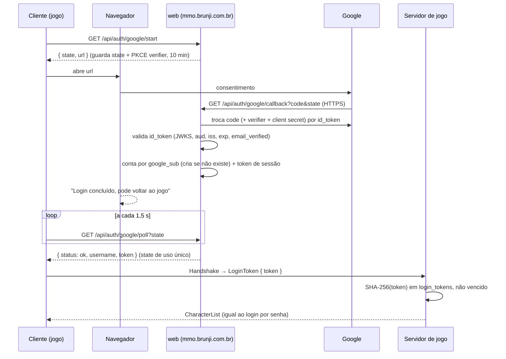

# Login com Google

Estado: implementado no `web`, no servidor de jogo e no cliente, **desligado
até as credenciais existirem**. Sem `GOOGLE_CLIENT_ID` e
`GOOGLE_CLIENT_SECRET` no ambiente do `web`, o `/api/auth/google/config`
responde `enabled: false` e o botão não aparece.

## Como o login funcionava (e continua funcionando)

O cliente **não** usa o `/api/login` do `web`. Ele abre o WebSocket do canal,
faz `Handshake` e manda `ClientMessage::Login { username, password }`. O
servidor de jogo confere o argon2 na tabela `accounts` (`server::auth`, com a
fila de login) e responde com a lista de personagens. Na troca de zona o
cliente reconecta e reenvia usuário e senha.

Por isso o Google precisa terminar numa credencial que o **servidor de jogo**
aceite: uma sessão (`ClientMessage::LoginToken { token }`).

## O fluxo novo

- **PKCE S256**, `state` aleatório de 192 bits, de uso único, vence em 10 min.
- O **client secret fica só no `web`**. O cliente não guarda nada do Google.
- O `web` não guarda access token do Google: usa o `id_token` uma vez.
- **Sessão**: token aleatório de 256 bits; o banco guarda só o SHA-256
  (`login_tokens`), vale 12 h. O cliente o reenvia a cada conexão (troca de
  zona) e esquece ao sair. Sessão vencida volta pra tela de login.
- **Conta**: `accounts.google_sub` (único entre quem tem). Primeiro login cria a
  conta com username derivado do nome (ou do e-mail), sem acento, 3–20
  caracteres, com sufixo se já existir. **Não vincula** por e-mail a uma conta
  de senha existente: o cadastro por senha não verifica e-mail, então "mesmo
  e-mail" não prova que é a mesma pessoa. Vincular conta existente fica pra
  depois (precisa de login já feito + confirmação).
- **Rate limit**: 10 inícios por minuto por IP (`X-Real-IP`/`X-Forwarded-For`
  do nginx), no máximo 5.000 pedidos pendentes.
- Não é preciso deep link no iOS: o app só abre o Safari e fica perguntando ao
  `web`. Depois de confirmar no Safari, o jogador volta pro app (a página diz
  isso) e o login entra sozinho.

## Variáveis de ambiente (`web`, em `/etc/tempest.env` na produção)

| Variável | Obrigatória | O quê |
|---|---|---|
| `GOOGLE_CLIENT_ID` | sim | Client ID do tipo "Aplicativo da Web" |
| `GOOGLE_CLIENT_SECRET` | sim | Secret do mesmo client |
| `GOOGLE_REDIRECT_URI` | não | padrão `https://mmo.brunji.com.br/api/auth/google/callback` |

O servidor de jogo não precisa de variável nova: lê `login_tokens` no mesmo
Postgres.

## Passo a passo no Google Cloud Console (você)

1. Entre em <https://console.cloud.google.com/> com a conta que vai ser dona do
   app e crie um projeto (ex. "Tempest").
2. **APIs e serviços → Tela de consentimento OAuth** (Google Auth Platform →
   Branding):
   - Tipo de usuário: **Externo**.
   - Nome do app: Tempest; e-mail de suporte; logo opcional.
   - Domínio autorizado: `brunji.com.br`.
   - Links de política de privacidade/termos (exigidos pra publicar; em
     "Teste" dá pra seguir sem).
   - Escopos: `openid`, `email`, `profile` (não sensíveis, sem verificação do
     Google).
   - Enquanto estiver em **Teste**, só entram os e-mails adicionados em
     "Usuários de teste". Pra abrir pra todos, clique em **Publicar app**.
3. **APIs e serviços → Credenciais → Criar credenciais → ID do cliente OAuth**:
   - Tipo: **Aplicativo da Web** (é ele que o fluxo usa, tanto no PC quanto no
     iPhone, porque o retorno cai no nosso `web`).
   - Nome: "Tempest web".
   - **URIs de redirecionamento autorizados**:
     `https://mmo.brunji.com.br/api/auth/google/callback`
   - Salve e copie o **Client ID** e o **Client secret**.
4. (Opcional, não usado agora) Um client **iOS** com bundle ID
   `com.brunji.tempest` só será necessário se um dia o app usar o SDK nativo do
   Google Sign-In em vez do Safari. O fluxo atual não precisa dele.

**Me mande:** o Client ID e o Client secret do client "Aplicativo da Web"
(o secret por um canal seguro, nunca em commit). Com eles eu ponho no
`/etc/tempest.env` da produção, reinicio o `tempest-web` e o botão aparece.

## Requisitos de infraestrutura

- O callback **tem que ser HTTPS** (o Google recusa redirect HTTP fora de
  localhost). O nginx de `mmo.brunji.com.br` já tem `listen 443 ssl` com
  `location /api/` → `127.0.0.1:8090`; conferir que o certificado está válido.
- O cliente ainda fala **HTTP puro** com o `web` na porta 80 (igual ao login por
  senha). O token de sessão trafega em claro nessa etapa — mesma pendência já
  anotada em SERVIDORES_E_CANAIS.md: migrar `api.rs`/`net.rs` pra HTTPS/WSS.

## Pendências

- HTTPS/WSS no cliente (vale pra senha e pra sessão).
- Vincular Google a conta de senha existente e trocar o username depois.
- Android: abrir URL ainda não implementado (`nativo::abrir_url` devolve
  `false`).
- Logout remoto / revogar sessões (hoje só vencem em 12 h).
